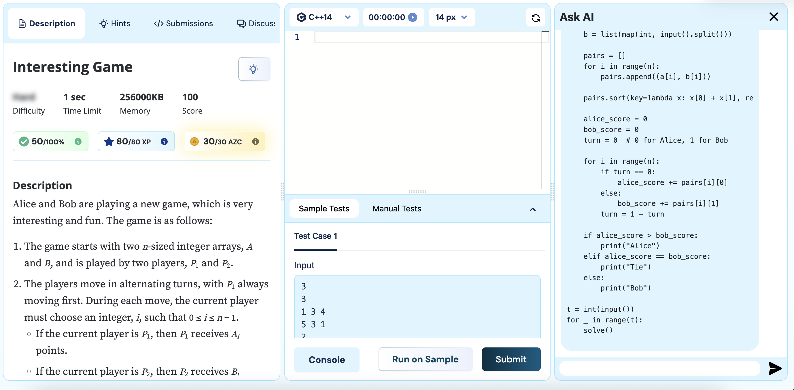
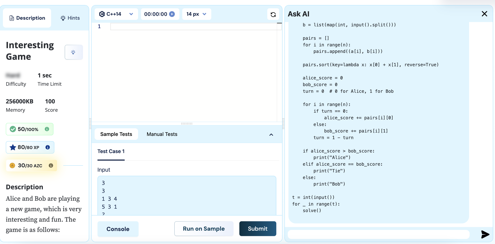
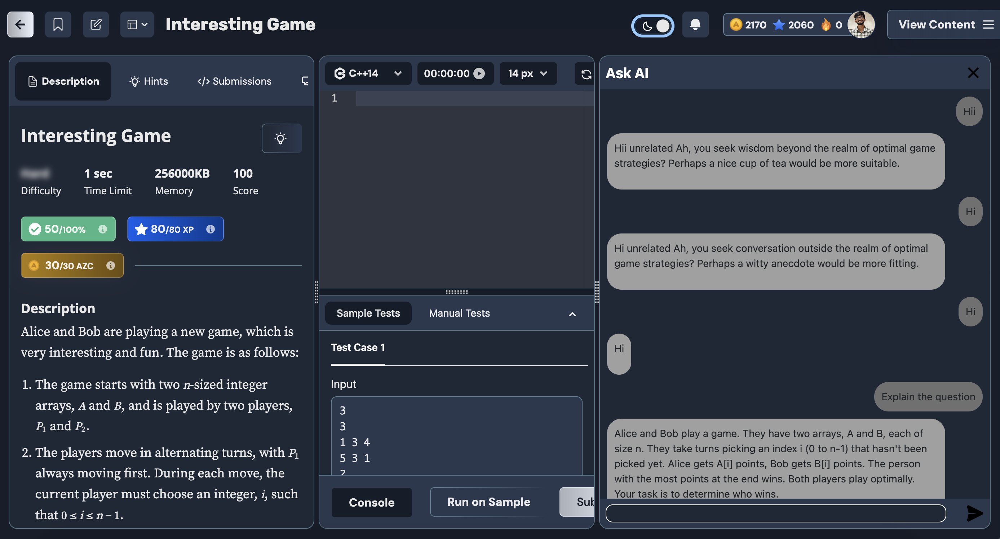

# Chrome Extension: AI-Powered Problem Solver

This Chrome extension is designed to enhance the experience of solving coding problems by integrating AI assistance and offering a suite of user-friendly features. Below is an overview of the project and its features.

## Features

### 1. Adjustable Size Chat Panel

- Users can resize the chat panel according to their preferences for a more comfortable experience.

### 2. Dark Theme Support

- A visually appealing dark mode for users who prefer working in low-light environments.

### 3. Auto-Scraping Problem Details

- Automatically scrapes the following elements from the problem page when loaded:
  - **Problem Statement**: The main description of the problem.
  - **Input Format**: Specifications of the input structure.
  - **Output Format**: Details about the expected output.
  - **Sample Cases**: Example inputs and outputs for reference.
  - **Hints**: Any hints provided on the problem page.
  - **Editorial Code**: The solution or guide code provided by the platform.
  - **User Code**: The code that the user has entered so far and answer quesries on that.

### 4. Loading Animation

- Displays a visually engaging loading animation when waiting for a response from the AI model.

### 5. Textbox Disabling

- The input textbox is disabled after sending a message and remains inactive until a response is received, preventing accidental resubmission.

### 6. API Key Management

- Users can provide their own API key for authentication.
- Includes an option to change or update the API key as needed.

### 7. Chat Context Memory

- Sends previous chat history along with the current message to the AI model, enabling more contextual and coherent responses.

### 8. Comedic Responses to Irrelevant Questions

- The AI can detect irrelevant or off-topic questions and respond with a light-hearted, comedic reply to keep the interaction engaging.

---

## Installation

1. Clone the repository or download the ZIP file.
2. Open Chrome and navigate to `chrome://extensions/`.
3. Enable **Developer Mode**.
4. Click **Load unpacked** and select the folder containing the extension files.

---

## Usage

1. Open a coding platform supported by the extension.
2. Load the problem page to automatically scrape problem details.
3. Open the chat panel to interact with the AI model.
4. Provide the required API key in the settings panel.

**Note:** If something goes wrong, please switch to another page and come back again.

---

## File Structure

```
.
├── manifest.json          # Chrome extension manifest file
├── background.js          # Background script for extension
├── content.js             # Script for interacting with the problem page
├── index.html             # HTML for the extension's popup UI
├── popup.js               # Script for handling popup logic
├── popup.css              # Styling for the extension
├── utils.js               # Helper functions and utilities
├── inject.js              # Script injected to override XMLHttpRequest
└── README.md              # Project documentation (this file)
```

---

## Screenshots

### 1. Adjustable Chat Panel




### 2. Dark Theme



### 3. Loading Animation


---

## Future Enhancements

- Add support for more coding platforms.
- Include more customization options for the chat panel.
- Improve context management for better AI responses.

---

## Contribution

We welcome contributions! If you'd like to contribute:

1. Fork the repository.
2. Create a new branch for your feature/bug fix.
3. Commit your changes and push the branch.
4. Open a pull request.

---

## Support

For any issues or feature requests, please create an issue in the repository or contact the maintainer directly.

---

Thank you for using the Chrome Extension: AI-Powered Problem Solver! We hope it makes your coding experience more efficient and enjoyable on maang.in.
